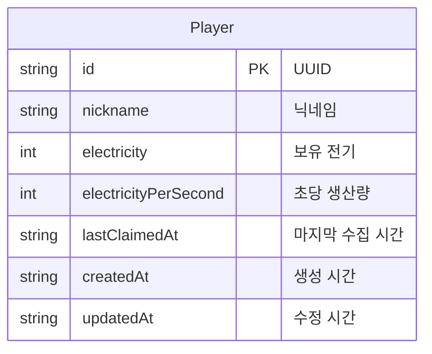
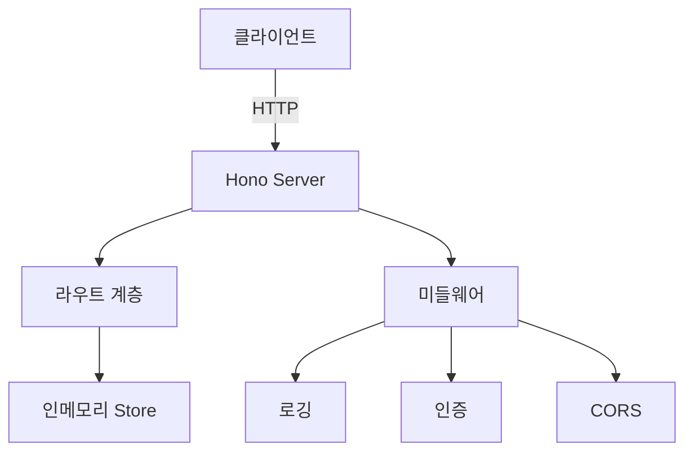
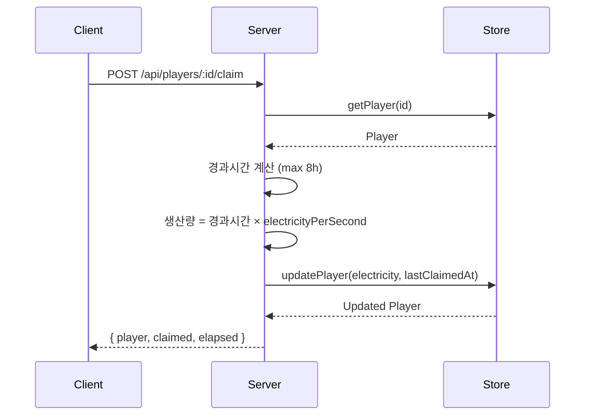
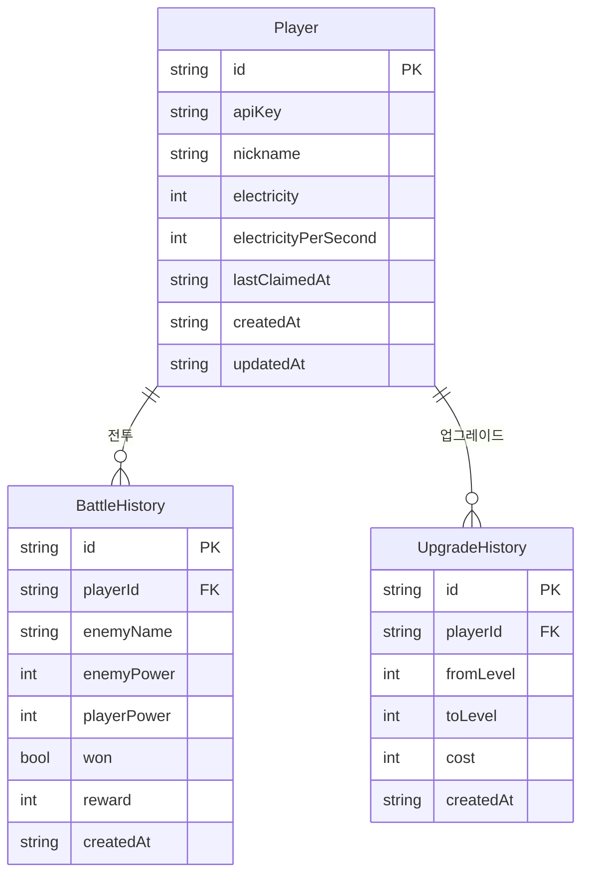

# ERD 및 아키텍처 문서 누락 분석

> 기준: 포트폴리오 기술 문서 수준

---

## 📊 현재 상태

```
문서화된 아키텍처 자료: 0개
```

| 항목 | 상태 |
|------|:---:|
| ERD (Entity Relationship Diagram) | ❌ |
| 시스템 아키텍처 다이어그램 | ❌ |
| API 흐름도 | ❌ |
| 데이터 모델 명세 | ❌ |
| 디렉토리 구조도 | ❌ |
| 배포 아키텍처 | ❌ |

---

## 🔴 Critical

### 1. ERD 없음

현재 데이터 모델은 `Player` 단일 엔티티지만, 이를 시각화한 문서가 없음.



### 2. 시스템 아키텍처 다이어그램 없음

전체 시스템 구성도가 없어 프로젝트 파악이 코드를 읽어야만 가능.



---

## 🟡 High

### 3. API 흐름도 없음

주요 비즈니스 로직의 요청 흐름을 시각화한 문서 없음.



### 4. 확장 ERD 없음

현재는 Player 1개 테이블이지만, DB 도입 시 필요한 테이블들:



---

## 🟢 Medium

### 5. 데이터 모델 명세 없음

각 필드의 제약조건, 기본값, 용도를 표로 정리한 문서 없음.

### 6. 배포 아키텍처 없음

Docker 도입 시 컨테이너 구성도 필요.

---

## 🎯 빠른 액션 (15분)

| 순서 | 작업 |
|:---:|------|
| 1 | Mermaid ERD (Player) → README에 추가 |
| 2 | 시스템 아키텍처 다이어그램 |
| 3 | Claim API 시퀀스 다이어그램 |
| 4 | DB 도입 대비 확장 ERD |
| 5 | 데이터 모델 명세 테이블 |
