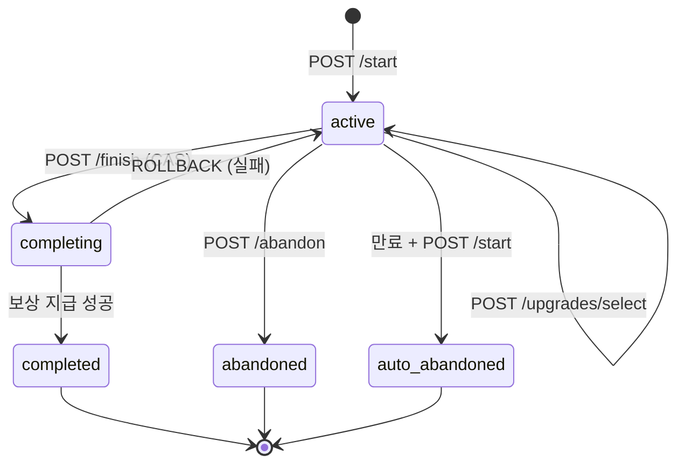
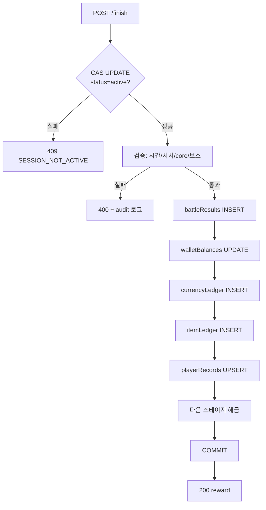
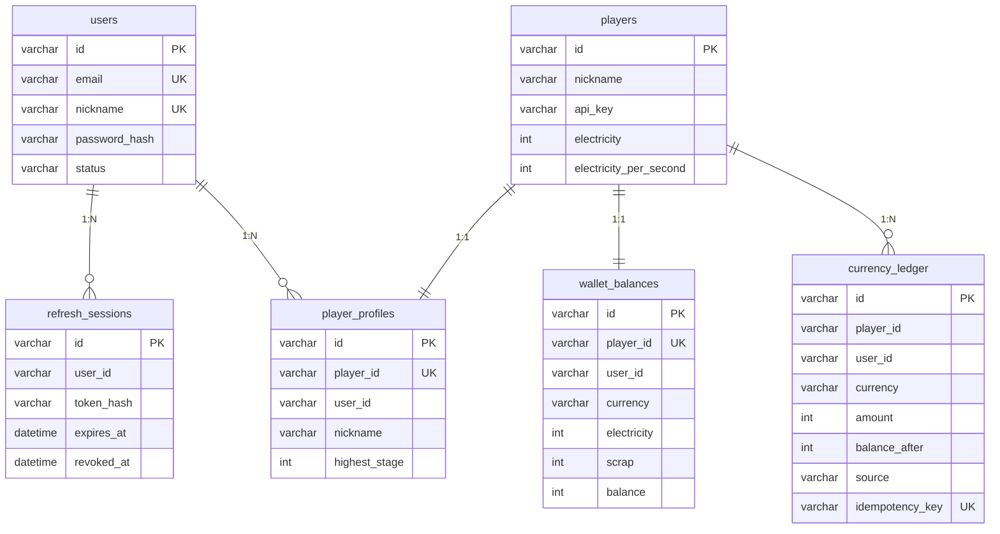

# Idle Game Server


[](./LICENSE)

Hono + TypeScript + MySQL 기반 방치형(idle) 게임 서버 API

## 기능

- ⚡ **전기 생산** — 오프라인 상태에서도 자동 생산 (최대 8시간 적립)
- 🔼 **업그레이드** — 전기를 소모하여 초당 생산량 증가
- ⚔️ **전투** — 랜덤 적과 전투, 승리 시 전기 보상
- 🏆 **랭킹** — totalWealth 기준 실시간 순위
- 🎁 **방치 보상** — 오프라인 시간에 비례한 보상 지급
- 🔐 **JWT 인증** — 회원가입/로그인, Access/Refresh Token
- 💰 **재화 지갑** — electricity, scrap 잔액 및 원장 추적
- 🤖 **전투 시스템 (v2)** — 서버 권위 전투 세션, 4개 스테이지, 30개 강화 선택지, 단일 트랜잭션 보상

## 기술 스택

| 구분 | 기술 |
|------|------|
| Runtime | Node.js 20+ |
| Framework | Hono |
| Language | TypeScript (strict) |
| Validation | Zod |
| Logging | Pino |
| Database | MySQL 8 + Drizzle ORM |
| Auth | JWT (jsonwebtoken + bcryptjs) |
| Test | Vitest |
| CI | GitHub Actions |
| Container | Docker Compose |

### 운영자 관리

```bash
# 최초 운영자 생성 (CLI)
OPERATOR_EMAIL=admin@example.com OPERATOR_PASSWORD=secure123 npm run db:seed-operator

# 역할: user, operator, admin
# - user: 일반 API만 접근
# - operator: /admin API 접근 (고액 지급 제한)
# - admin: 모든 권한 (고액 지급 가능)
```

### 권한 목록

| 권한 | operator | admin |
|---|---|---|
| 사용자 조회·상세 | ✅ | ✅ |
| 재화·아이템 지급 (<10,000) | ✅ | ✅ |
| 재화·아이템 지급 (≥10,000) | ❌ | ✅ |
| 제재 생성·철회 | ✅ | ✅ |
| 보안 이벤트 조회·검토 | ✅ | ✅ |
| 감사 로그 조회 | ✅ | ✅ |

### 감사 로그

```bash
# 운영 감사 로그 조회
curl -H "Authorization: Bearer <operatorToken>" \
  "http://localhost:3000/admin/audit-logs?action=user_suspended&limit=50"

# 보안 이벤트 조회
curl -H "Authorization: Bearer <operatorToken>" \
  "http://localhost:3000/admin/security-events?eventType=battle_rejected"

# 사용자별 원장
curl -H "Authorization: Bearer <operatorToken>" \
  "http://localhost:3000/admin/users/:id/wallet-ledger?currency=scrap"
```

- 실시간 프레임 단위 서버 시뮬레이션
- 파츠/장비/연구 시스템 (스냅샷 placeholder만 존재)
- 파츠 강화·랜덤 옵션·제련
- PvP, 멀티플레이
- 매치메이킹
- Redis 분산 Rate Limit (단일 인스턴스 in-memory로 충분)
- 백그라운드 Worker (세션 만료 등 요청 시점 판정)
- AI 기반 부정행위 탐지 (통계적 상한 + audit 로그로 충분)
- 다중 API 서버 / 수평 확장 (단일 인스턴스 기준)
- Unity 클라이언트 (서버 API만 구현)
- WebSocket 실시간 동기화
- 관리자 대시보드
- 길드·친구·우편·출석·업적·시즌 (소셜/라이브 서비스)
- 결제·상점·재화 구매

## 백업

```bash
# 수동 백업
DB_PASSWORD=changeme ./scripts/backup.sh

# Docker Compose 환경
DB_HOST=127.0.0.1 DB_PASSWORD=changeme ./scripts/backup.sh -o ./backups

# cron 자동화 (매일 02:00 UTC)
0 2 * * * cd /app && DB_PASSWORD=xxx ./scripts/backup.sh
```

## 복구

```bash
# 검증만 (--dry-run)
./scripts/recover.sh --dry-run latest

# 검증용 DB로 복구 (기본: idle_game_recovered)
./scripts/recover.sh latest

# 복구 중 쓰기 차단: docker-compose stop app
# 복구 완료 후: docker-compose start app && curl /health/ready

# 복구 검증
mysql -e "SELECT COUNT(*) FROM players; SELECT COUNT(*) FROM currency_ledger;"
curl http://localhost:3000/health/ready
```

백업: `--single-transaction` (InnoDB), 30일 보관, UTC timestamp, .tmp → rename, chmod 600
복구: gzip 검증 → checksum 확인 → DROP 확인 → 복원 → 마이그레이션 → 검증

### 최소 복구 리허설

```bash
# 1. 백업 생성
./scripts/backup.sh

# 2. dry-run 검증
./scripts/recover.sh --dry-run latest

# 3. 검증용 DB로 복구
./scripts/recover.sh --target-db idle_game_recovery_test latest

# 4. 복구 검증
mysql -e "USE idle_game_recovery_test; SHOW TABLES; SELECT COUNT(*) FROM players;"

# 5. healthcheck
curl http://localhost:3000/health/ready
```

### 운영 DB 복구 전 체크리스트

- [ ] 최신 백업 존재 확인 (`ls backups/*.sql.gz`)
- [ ] `--dry-run` 으로 검증 완료
- [ ] `docker-compose stop app` (API 쓰기 차단)
- [ ] 복구 대상 DB 백업 (`./scripts/backup.sh`)
- [ ] `integrity-check.sh` 실행 (복구 전 무결성 확인)
- [ ] 복구 실행 (`./scripts/recover.sh latest`)
- [ ] `integrity-check.sh` 재실행 (복구 후 무결성 확인)
- [ ] `docker-compose start app` (API 재개)
- [ ] `/health/ready` 확인
- [ ] 핵심 API smoke test

### 안전한 종료와 재시작

```bash
# Graceful shutdown (SIGTERM)
docker-compose stop app      # 진행 중 요청 완료 후 종료 (10s timeout)

# 재시작
docker-compose start app     # DB 연결 복구, GET /battles/:id 로 세션 복원
```

### 비밀값 관리

Production 필수 환경변수 (`validate-secrets.ts`로 검증):
- `JWT_ACCESS_SECRET` / `JWT_REFRESH_SECRET` (dev-secret 사용 금지)
- `DB_PASSWORD` / `MYSQL_ROOT_PASSWORD` (changeme 사용 금지)
- `.env` 파일은 `.dockerignore`로 이미지 제외
- 백업 파일은 `chmod 600` 적용

## 이번 단계에서 제외한 기능

- 실시간 프레임 단위 서버 시뮬레이션
- 파츠/장비/연구 시스템 (스냅샷 placeholder만 존재)
- 파츠 강화·랜덤 옵션·제련
- PvP, 멀티플레이
- 매치메이킹
- Redis 분산 Rate Limit (단일 인스턴스 in-memory로 충분)
- 백그라운드 Worker (세션 만료 등 요청 시점 판정)
- AI 기반 부정행위 탐지 (통계적 상한 + audit 로그로 충분)
- 다중 API 서버 / 수평 확장 (단일 인스턴스 기준)
- Unity 클라이언트 (서버 API만 구현)
- WebSocket 실시간 동기화
- 관리자 대시보드
- 길드·친구·우편·출석·업적·시즌 (소셜/라이브 서비스)
- 결제·상점·재화 구매
- 관리자 웹 UI
- Prometheus·Grafana·ELK (별도 모니터링 스택)
- 외부 상용 APM (Datadog/NewRelic 등)
- 이메일·SMS 알림
- 자동 백업 스케줄러 (cron 예시만 제공)

## 프로젝트 구조

```
src/
├── index.ts              # 서버 진입점 (미들웨어, graceful shutdown)
├── routes.ts             # 게임 API 라우트
├── auth.routes.ts        # 인증 API 라우트
├── config.ts             # 기본 설정 상수
├── types.ts              # 저장소 모델 (Player)
├── dto.ts                # 공개 응답 DTO + 변환 함수
├── store.ts              # JSON Player 저장소 (개발/폴백)
├── store-auth.ts         # JSON Auth 저장소 (회원가입/로그인/세션)
├── store-wallet.ts       # JSON Wallet 저장소 (잔액/원장)
├── provider.ts           # 저장소 provider (MySQL 우선, JSON 폴백)
├── repository.ts         # PlayerRepository 인터페이스
├── shared/
│   ├── errors.ts         # 커스텀 에러 클래스
│   ├── validator.ts      # Zod 검증 + UUID 미들웨어
│   ├── auth.ts           # API 키 인증 (레거시)
│   ├── auth-service.ts   # JWT 인증 서비스
│   ├── jwt-auth.ts       # JWT 미들웨어
│   ├── wallet.ts         # 재화 잔액/원장 서비스
│   ├── idempotency.ts    # 멱등성 키 미들웨어
│   ├── rate-limit.ts     # Rate limiting
│   ├── game-math.ts      # 게임 밸런스 상수 + 생산량 계산
│   ├── logger.ts         # Pino 로거
│   └── validate-secrets.ts # Production 비밀값 검증
├── db/
│   ├── schema.ts         # Drizzle MySQL 스키마 (6 테이블)
│   ├── connection.ts     # MySQL 연결 풀
│   ├── migrate.ts        # 마이그레이션 실행
│   ├── seed.ts           # 개발용 시드 데이터
│   ├── import-json.ts    # JSON → MySQL import
│   ├── mysql.repository.ts   # MySQL PlayerRepository 구현체
│   ├── mysql-auth.repository.ts  # MySQL AuthRepository 구현체
│   └── mysql-wallet.repository.ts # MySQL WalletRepository 구현체
│   └── migrations/         # drizzle-kit 생성 SQL
└── __tests__/
    ├── store.test.ts     # 저장소 + 신뢰성 테스트
    ├── routes.test.ts    # API 테스트
    ├── idempotency.test.ts # 멱등성 테스트
    └── integration.test.ts # MySQL 통합 테스트 (todo)
```

## 저장소 선택 (provider 패턴)

`DB_DRIVER` 환경변수로 저장소를 선택합니다. MySQL 연결 실패 시 자동으로 JSON으로 폴백됩니다.

| DB_DRIVER | 저장소 | 사용처 |
|-----------|--------|--------|
| `json` | JSON 파일 (store.ts + store-auth.ts + store-wallet.ts) | 개발/테스트, MySQL 불필요 |
| `mysql` (기본) | MySQL + Drizzle ORM | 프로덕션, Docker Compose |
| 미설정 | MySQL 시도 → 실패 시 JSON 자동 폴백 | 개발 편의 |

### 데이터 파일

| 파일 | 저장 내용 |
|------|----------|
| `data.json` | 플레이어 (Player) |
| `data-users.json` | 사용자 계정 (User) |
| `data-sessions.json` | Refresh 세션 |
| `data-sanctions.json` | 계정 제재 |
| `data-profiles.json` | 플레이어 프로필 |
| `data-wallets.json` | 재화 지갑 잔액 |
| `data-ledger.json` | 재화 원장 (currency_ledger) |

> ⚠️ JSON 파일은 개발/테스트 전용입니다. 프로덕션에서는 MySQL을 사용하세요.

## 실행

```bash
npm install
cp .env.example .env     # 환경변수 설정

# JSON 파일 저장소 (MySQL 불필요, 개발/테스트)
DB_DRIVER=json npm run dev

# MySQL + Docker Compose
docker-compose up -d mysql
npm run db:migrate
npm run dev
```

## 환경 변수

| 변수 | 기본값 | 설명 |
|------|------|------|
| `PORT` | `3000` | 서버 포트 |
| `NODE_ENV` | `development` | 실행 환경 |
| `LOG_LEVEL` | `info` | 로그 레벨 |
| `CORS_ORIGIN` | `http://localhost:5173` | CORS 오리진 |
| **MySQL** | | |
| `DB_HOST` | `mysql` | MySQL 호스트 |
| `DB_PORT` | `3306` | MySQL 포트 |
| `DB_USER` | `gameuser` | MySQL 사용자 |
| `DB_PASSWORD` | — | MySQL 비밀번호 |
| `DB_NAME` | `idle_game` | 데이터베이스 이름 |
| `DB_DRIVER` | `mysql` | 저장소 드라이버 (`json`=JSON 파일, `mysql`=MySQL).<br>MySQL 미연결 시 자동 JSON 폴백 |
| `MYSQL_ROOT_PASSWORD` | — | MySQL root 비밀번호 |
| **JWT** | | |
| `JWT_ACCESS_SECRET` | — | Access Token 서명 비밀키 |
| `JWT_REFRESH_SECRET` | — | Refresh Token 서명 비밀키 |
| `JWT_ACCESS_EXPIRES_IN` | `15m` | Access Token 만료 시간 |
| `JWT_REFRESH_EXPIRES_IN` | `7d` | Refresh Token 만료 시간 |

## API 문서

### 헬스 체크

```bash
GET /health   → {"status":"ok"}
GET /ready    → {"status":"ready","uptime":3600,"checks":{"database":"connected"}}
```

### 인증

#### 회원가입 (Idempotency-Key 필요)
```bash
POST /auth/register
Idempotency-Key: register-550e8400-e29b-41d4-a716-446655440000
Content-Type: application/json
{"email":"user@example.com","password":"password123!","nickname":"플레이어"}
→ 201 {userId, playerId, accessToken, refreshToken}
```

#### 로그인
```bash
POST /auth/login
{"email":"user@example.com","password":"password123!"}
→ 200 {userId, playerId, accessToken, refreshToken}
```

#### 토큰 갱신
```bash
POST /auth/refresh
{"refreshToken":"..."}
→ 200 {accessToken, refreshToken}
```

#### 로그아웃
```bash
POST /auth/logout
{"refreshToken":"..."}
→ 200 {"status":"ok"}
```

### 지갑 (JWT 인증 필요)

```bash
GET /wallet          → {playerId, electricity, electricityPerSecond}
GET /wallet/ledger   → [{id, amount, balanceAfter, source, ...}]

# 잔액/원장은 모든 재화 변경(claim/upgrade/battle) 시
# wallet_balances + currency_ledger에 자동 기록됨
```

### 플레이어

```bash
POST /api/players           # 생성 (닉네임 2~20자)
GET  /api/players/:id       # 조회
GET  /api/players           # 전체 목록
```

### 전기 생산 (JWT 인증 필요)

```bash
# Authorization: Bearer <accessToken>
curl -X POST http://localhost:3000/api/players/:id/claim \
  -H "Authorization: Bearer <accessToken>" \
  -H "Idempotency-Key: claim-$(uuidgen)"

POST /api/players/:id/claim   # 수집
GET  /api/players/:id/claim   # 대기량 조회
GET  /api/players/:id/idle-rewards  # 방치 보상
```

### 업그레이드 (JWT 인증 + Idempotency-Key 필요)

```bash
GET  /api/players/:id/upgrade                 # 비용 조회
POST /api/players/:id/upgrade                 # 구매
Idempotency-Key: upgrade-550e8400-e29b-41d4-a716-446655440000
```

### 전투 (JWT 인증 + Idempotency-Key 필요)

```bash
POST /api/players/:id/battle
Idempotency-Key: battle-550e8400-e29b-41d4-a716-446655440000
→ {won, reward, enemyName, enemyPower, playerPower}
```

### 랭킹

```bash
GET /api/rankings   # totalWealth 기준 내림차순
```

### 전투 (v2) (JWT 인증 + Idempotency-Key 필요)

```bash
POST /battles/start                       # 세션 생성
Idempotency-Key: start-550e8400-e29b-41d4-a716-446655440000
  Body: { "stageCode": "stage_01_ruins" }

GET  /battles/:sessionId                  # 세션 상태 + recovery

POST /battles/:sessionId/progress         # 진행 이벤트
Idempotency-Key: progress-550e8400-e29b-41d4-a716-446655440000
  Body: { "sequence": 1, "killsDelta": 5, "coreEnergyDelta": 25, "bossId": "boss_0" }

POST /battles/:sessionId/upgrades/select  # 강화 선택
Idempotency-Key: select-550e8400-e29b-41d4-a716-446655440000
  Body: { "selectedUpgradeCode": "machine_gun_1" }

POST /battles/:sessionId/finish           # 전투 종료
Idempotency-Key: finish-550e8400-e29b-41d4-a716-446655440000
  Body: { "totalKills": 245, "totalCoreEnergy": 480, "bossDefeated": ["boss_0"], "elapsedSeconds": 292 }

POST /battles/:sessionId/abandon          # 포기 (보상 없음)
Idempotency-Key: abandon-550e8400-e29b-41d4-a716-446655440000

GET  /stages                              # 스테이지 목록 + 플레이어 진행도
```

```

## 전투 시스템 (v2)

### 서버·클라이언트 책임 경계

| 서버 (권위) | 클라이언트 |
|---|---|
| 세션 생성, 스탯 스냅샷, 콘텐츠 버전 | 스테이지 선택 요청 |
| 이벤트 검증 (처치/core/보스 상한) | 전투 시뮬레이션, 이동/대시/궁극기 |
| 강화 선택지 생성·저장·검증 | 3지선다 선택 |
| 보상 계산, 단일 트랜잭션 지급 | 결과 확인 |
| 위반 시 audit 로그 + 400/409 | — |

클라이언트는 보상량, 결과 유형, 강화 선택지를 직접 결정할 수 없다.

### 세션 생명주기



### 결과 확정 트랜잭션



### 이벤트 처리

- progress 이벤트는 2~5초 간격 배치 전송
- 각 이벤트는 `sequence` (1부터 단조증가) 필수
- DB UNIQUE(battleSessionId, sequence)로 중복 차단
- 프레임 단위 이벤트를 저장하지 않는다

### core_energy와 레벨업

- 각 스테이지의 `corePerKill` × kills만큼 core_energy 획득
- `corePerLevel` 누적 시 레벨업 → 서버가 3개 강화 선택지 생성
- 선택지는 세션 시드 기반 결정론적 생성, DB에 저장
- 미선택 강화가 있으면 progress/finish 차단

### 강화 선택지

- 30개 강화, 13개 진화 그룹, 3티어 진화 (machine_gun_1 → _2 → _3)
- 5개 카테고리: weapon, drone, armor, ultimate, utility
- 가중치 랜덤 (weight), prerequisites, maxTier, enabled 필터
- 같은 그룹 중복 제시 안 함, 서버가 제공한 선택지만 선택 가능

### 보상

| 유형 | 내용 |
|---|---|
| scrap | kills × scrapPerKill + stageRewards bonus |
| blueprint | dropRate 확률, 최초 클리어 확정 |
| part | MVP: null (파츠 시스템 구현 시) |
| unlock | 최초 클리어 시 다음 스테이지 해금 |
| record | 최고 처치/최단 시간 갱신 |

모든 보상은 단일 DB 트랜잭션으로 처리된다.

### 멱등성과 동시성

| 메커니즘 | 적용 대상 |
|---|---|
| Idempotency-Key 헤더 | start, upgrades/select, finish, abandon |
| DB UNIQUE(battleSessionId, sequence) | progress 이벤트 |
| CAS UPDATE (WHERE status='active') | finish (단 하나만 성공) |
| battleResults.battleSessionId UNIQUE | 이중 확정 방지 |
| currencyLedger.idempotencyKey UNIQUE | 이중 입금 방지 |

동시 finish 요청 시 CAS에 성공한 하나만 보상을 지급하고,
다른 요청은 409 SESSION_NOT_ACTIVE로 거부된다.
다른 사용자의 세션은 독립적이며 불필요하게 직렬화되지 않는다.

### 세션 만료와 재접속

- `expiresAt = startTime + durationSeconds + 120s` (BATTLE_POLICY)
- 만료된 세션은 progress/upgrade/finish 거부 (400 SESSION_EXPIRED)
- POST /start 시 만료 세션 자동 abandon 후 새 세션 생성
- GET /battles/:sessionId로 클라이언트 재접속 시 상태 복원 가능
- 별도 Worker 없이 요청 시점에 만료 판정

### MVP 부정행위 방지 범위

**보호됨 (서버 권위)**
- 세션 생성, 스탯 스냅샷, 콘텐츠 버전
- core_energy/kills 상한 검증 (스테이지 정의 + 메카 스탯 기반)
- 보스 처치 타이밍·순서 검증
- 강화 선택지 생성·저장·검증 (클라이언트 위조 불가)
- 최종 보상량 계산 + 단일 트랜잭션 지급

**경계 밖 (클라이언트 책임)**
- 실시간 전투 시뮬레이션 (이동, 충돌, 프레임별 데미지)
- 개별 적 처치 순서와 정확한 타이밍
- 플레이어 컨트롤 (대시, 궁극기)

**Unity 연동 예정**
- 클라이언트가 progress로 2~5초 간격 누적 수치 보고
- 서버는 통계적 상한 + sessionSeed 기반 재현 검증으로 확장 가능

### 랭킹 (기존)

### 멱등성

변경 요청(POST)에 `Idempotency-Key` 헤더를 사용하면 중복 처리를 방지합니다:
```bash
POST /api/players/:id/claim
Idempotency-Key: claim-550e8400-e29b-41d4-a716-446655440000
```

### 에러 응답 형식

```json
{ "error": "사람이 읽는 메시지", "code": "ERROR_CODE" }
```

| Status | Code | 설명 |
|:---:|------|------|
| 400 | `BAD_REQUEST` | 잘못된 입력 |
| 400 | `INVALID_JSON` | JSON 파싱 실패 |
| 400 | `INSUFFICIENT_RESOURCE` | 전기 부족 |
| 400 | `MISSING_IDEMPOTENCY_KEY` | 멱등성 키(Idempotency-Key) 헤더 없음 |
| 401 | `UNAUTHORIZED` | 인증 필요 |
| 401 | `INVALID_TOKEN` | 유효하지 않은 토큰 |
| 401 | `TOKEN_EXPIRED` | 만료된 토큰 |
| 401 | `INVALID_CREDENTIALS` | 이메일/비밀번호 불일치 |
| 403 | `FORBIDDEN` | 권한 없음 |
| 400 | `IDEMPOTENCY_KEY_TOO_LONG` | 멱등성 키 64자 초과 |
| 403 | `ACCOUNT_DISABLED` | 비활성화된 계정 |
| 403 | `ACCOUNT_SUSPENDED` | 제재된 계정 |
| 404 | `NOT_FOUND` | 리소스 없음 |
| 404 | `ROUTE_NOT_FOUND` | 정의되지 않은 경로 |
| 404 | `WALLET_NOT_FOUND` | 지갑 없음 |
| 409 | `NICKNAME_CONFLICT` | 닉네임 중복 |
| 409 | `DUPLICATE_ACCOUNT` | 이메일/닉네임 중복 |
| 429 | `RATE_LIMITED` | 요청 제한 초과 |
| 500 | `INTERNAL_ERROR` | 서버 내부 오류 |

## 데이터베이스

### 스키마 (6개 테이블)

| 테이블 | 용도 |
|------|------|
| `players` | 게임 플레이어 데이터 |
| `users` | 인증 계정 |
| `wallet_balances` | 재화 잔액 (electricity + scrap) |
| `currency_ledger` | 재화 변동 기록 (append-only) |
| `refresh_sessions` | JWT Refresh Token 관리 |
| `player_profiles` | 플레이어 부가 정보 |

### 재화 트랜잭션 설계

모든 재화 변동은 `adjustBalance()` 단일 진입점을 통해 처리:

```
BEGIN TRANSACTION
  1. idempotencyKey SELECT → 중복 확인
  2. wallet_balances SELECT ... FOR UPDATE → 행 잠금
  3. balance < 0 검증 → 실패 시 400
  4. wallet_balances UPDATE → 원자적 증감
  5. currency_ledger INSERT → 감사 기록
COMMIT
```

- `currency_ledger` 는 append-only, 수정/삭제 불가
- `idempotency_key` UNIQUE 제약으로 2중 중복 방지
- 같은 키 + 다른 payload → `request_hash` 비교 후 409

### 멱등성

클라이언트가 `Idempotency-Key` 헤더를 전송하면 동일 요청이 두 번 처리되지 않음:

| 상황 | 결과 |
|------|------|
| 새 요청 | 정상 처리, ledger 기록 |
| 동일 키 + 동일 payload 재요청 | `{ success: false }` + 원본 balanceAfter |
| 동일 키 + 다른 payload | 409 충돌 |

### ERD



### 마이그레이션

```bash
npm run db:generate     # 스키마 → SQL 생성
npm run db:migrate      # 마이그레이션 실행
npm run db:seed         # 시드 데이터 (20명)
npm run db:import-json  # 기존 data.json → MySQL import (중복 무시)
```

## 테스트

```bash
npm test              # 유닛 테스트 (55개)
npm run test:watch    # watch 모드
npm run type-check    # 타입 검사

# MySQL 통합 테스트
docker-compose up -d mysql
DB_DRIVER=mysql DB_NAME=idle_game_test npm run db:migrate
DB_DRIVER=mysql DB_NAME=idle_game_test npm test -- --include
```
