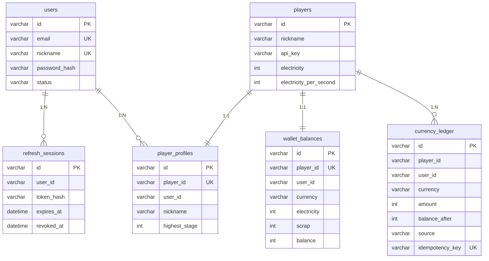

# Idle Game Server


[](./LICENSE)

Hono + TypeScript + MySQL 기반 방치형(idle) 게임 서버 API

## 기능

- ⚡ **전기 생산** — 오프라인 상태에서도 자동 생산 (최대 8시간 적립)
- 🔼 **업그레이드** — 전기를 소모하여 초당 생산량 증가
- ⚔️ **전투** — 랜덤 적과 전투, 승리 시 전기 보상
- 🏆 **랭킹** — totalWealth 기준 실시간 순위
- 🎁 **방치 보상** — 오프라인 시간에 비례한 보상 지급
- 🔐 **JWT 인증** — 회원가입/로그인, Access/Refresh Token
- 💰 **재화 지갑** — electricity, scrap 잔액 및 원장 추적

## 기술 스택

| 구분 | 기술 |
|------|------|
| Runtime | Node.js 20+ |
| Framework | Hono |
| Language | TypeScript (strict) |
| Validation | Zod |
| Logging | Pino |
| Database | MySQL 8 + Drizzle ORM |
| Auth | JWT (jsonwebtoken + bcryptjs) |
| Test | Vitest |
| CI | GitHub Actions |
| Container | Docker Compose |

## 프로젝트 구조

```
src/
├── index.ts              # 서버 진입점 (미들웨어, graceful shutdown)
├── routes.ts             # 게임 API 라우트
├── auth.routes.ts        # 인증 API 라우트
├── config.ts             # 기본 설정 상수
├── types.ts              # 저장소 모델 (Player)
├── dto.ts                # 공개 응답 DTO + 변환 함수
├── store.ts              # JSON 파일 저장소 (개발/폴백)
├── provider.ts           # 저장소 provider (MySQL 우선, JSON 폴백)
├── repository.ts         # PlayerRepository 인터페이스
├── shared/
│   ├── errors.ts         # 커스텀 에러 클래스
│   ├── validator.ts      # Zod 검증 + UUID 미들웨어
│   ├── auth.ts           # API 키 인증 (레거시)
│   ├── auth-service.ts   # JWT 인증 서비스
│   ├── jwt-auth.ts       # JWT 미들웨어
│   ├── wallet.ts         # 재화 잔액/원장 서비스
│   ├── idempotency.ts    # 멱등성 키 미들웨어
│   ├── rate-limit.ts     # Rate limiting
│   ├── game-math.ts      # 게임 밸런스 상수 + 생산량 계산
│   ├── logger.ts         # Pino 로거
│   └── validate-secrets.ts # Production 비밀값 검증
├── db/
│   ├── schema.ts         # Drizzle MySQL 스키마 (6 테이블)
│   ├── connection.ts     # MySQL 연결 풀
│   ├── migrate.ts        # 마이그레이션 실행
│   ├── seed.ts           # 개발용 시드 데이터
│   ├── import-json.ts    # JSON → MySQL import
│   ├── mysql.repository.ts # MySQL PlayerRepository 구현체
│   └── migrations/       # drizzle-kit 생성 SQL
└── __tests__/
    ├── store.test.ts     # 저장소 + 신뢰성 테스트
    ├── routes.test.ts    # API 테스트
    ├── idempotency.test.ts # 멱등성 테스트
    └── integration.test.ts # MySQL 통합 테스트 (todo)
```

## 실행

```bash
npm install
cp .env.example .env     # 환경변수 설정

# JSON 파일 저장소 (MySQL 없이 개발)
npm run dev

# MySQL + Docker Compose
docker-compose up -d mysql
npm run db:migrate
npm run dev
```

## 환경 변수

| 변수 | 기본값 | 설명 |
|------|------|------|
| `PORT` | `3000` | 서버 포트 |
| `NODE_ENV` | `development` | 실행 환경 |
| `LOG_LEVEL` | `info` | 로그 레벨 |
| `CORS_ORIGIN` | `http://localhost:5173` | CORS 오리진 |
| **MySQL** | | |
| `DB_HOST` | `mysql` | MySQL 호스트 |
| `DB_PORT` | `3306` | MySQL 포트 |
| `DB_USER` | `gameuser` | MySQL 사용자 |
| `DB_PASSWORD` | — | MySQL 비밀번호 |
| `DB_NAME` | `idle_game` | 데이터베이스 이름 |
| `DB_DRIVER` | `mysql` | `json` 지정 시 JSON 파일 저장소 |
| `MYSQL_ROOT_PASSWORD` | — | MySQL root 비밀번호 |
| **JWT** | | |
| `JWT_ACCESS_SECRET` | — | Access Token 서명 비밀키 |
| `JWT_REFRESH_SECRET` | — | Refresh Token 서명 비밀키 |
| `JWT_ACCESS_EXPIRES_IN` | `15m` | Access Token 만료 시간 |
| `JWT_REFRESH_EXPIRES_IN` | `7d` | Refresh Token 만료 시간 |

## API 문서

### 헬스 체크

```bash
GET /health   → {"status":"ok"}
GET /ready    → {"status":"ready","uptime":3600,"checks":{"database":"connected"}}
```

### 인증

#### 회원가입
```bash
POST /auth/register
Content-Type: application/json
{"email":"user@example.com","password":"password123!","nickname":"플레이어"}
→ 201 {userId, playerId, accessToken, refreshToken}
```

#### 로그인
```bash
POST /auth/login
{"email":"user@example.com","password":"password123!"}
→ 200 {userId, playerId, accessToken, refreshToken}
```

#### 토큰 갱신
```bash
POST /auth/refresh
{"refreshToken":"..."}
→ 200 {accessToken, refreshToken}
```

#### 로그아웃
```bash
POST /auth/logout
{"refreshToken":"..."}
→ 200 {"status":"ok"}
```

### 지갑 (JWT 인증 필요)

```bash
GET /wallet          → {playerId, electricity, electricityPerSecond}
GET /wallet/ledger   → [{id, amount, balanceAfter, source, ...}]
```

### 플레이어

```bash
POST /api/players           # 생성 (닉네임 2~20자)
GET  /api/players/:id       # 조회
GET  /api/players           # 전체 목록
```

### 전기 생산 (JWT 인증 필요)

```bash
# Authorization: Bearer <accessToken>
curl -X POST http://localhost:3000/api/players/:id/claim \
  -H "Authorization: Bearer <accessToken>" \
  -H "Idempotency-Key: claim-$(uuidgen)"

POST /api/players/:id/claim   # 수집
GET  /api/players/:id/claim   # 대기량 조회
GET  /api/players/:id/idle-rewards  # 방치 보상
```

### 업그레이드 (JWT 인증 필요)

```bash
GET  /api/players/:id/upgrade   # 비용 조회
POST /api/players/:id/upgrade   # 구매
```

### 전투 (JWT 인증 필요)

```bash
POST /api/players/:id/battle
→ {won, reward, enemyName, enemyPower, playerPower}
```

### 랭킹

```bash
GET /api/rankings   # totalWealth 기준 내림차순
```

### 멱등성

변경 요청(POST)에 `Idempotency-Key` 헤더를 사용하면 중복 처리를 방지합니다:
```bash
POST /api/players/:id/claim
Idempotency-Key: claim-550e8400-e29b-41d4-a716-446655440000
```

### 에러 응답 형식

```json
{ "error": "사람이 읽는 메시지", "code": "ERROR_CODE" }
```

| Status | Code | 설명 |
|:---:|------|------|
| 400 | `BAD_REQUEST` | 잘못된 입력 |
| 400 | `INVALID_JSON` | JSON 파싱 실패 |
| 400 | `INSUFFICIENT_RESOURCE` | 전기 부족 |
| 400 | `INSUFFICIENT_BALANCE` | 잔액 부족 |
| 400 | `MISSING_IDEMPOTENCY_KEY` | 멱등성 키 없음 |
| 401 | `UNAUTHORIZED` | 인증 필요 |
| 401 | `INVALID_TOKEN` | 유효하지 않은 토큰 |
| 401 | `TOKEN_EXPIRED` | 만료된 토큰 |
| 401 | `INVALID_CREDENTIALS` | 이메일/비밀번호 불일치 |
| 403 | `FORBIDDEN` | 권한 없음 |
| 403 | `ACCOUNT_DISABLED` | 비활성화된 계정 |
| 404 | `NOT_FOUND` | 리소스 없음 |
| 404 | `ROUTE_NOT_FOUND` | 정의되지 않은 경로 |
| 404 | `WALLET_NOT_FOUND` | 지갑 없음 |
| 409 | `NICKNAME_CONFLICT` | 닉네임 중복 |
| 409 | `DUPLICATE_ACCOUNT` | 이메일 중복 |
| 429 | `RATE_LIMITED` | 요청 제한 초과 |
| 500 | `INTERNAL_ERROR` | 서버 내부 오류 |

## 데이터베이스

### 스키마 (6개 테이블)

| 테이블 | 용도 |
|------|------|
| `players` | 게임 플레이어 데이터 |
| `users` | 인증 계정 |
| `wallet_balances` | 재화 잔액 (electricity + scrap) |
| `currency_ledger` | 재화 변동 기록 (append-only) |
| `refresh_sessions` | JWT Refresh Token 관리 |
| `player_profiles` | 플레이어 부가 정보 |

### 재화 트랜잭션 설계

모든 재화 변동은 `adjustBalance()` 단일 진입점을 통해 처리:

```
BEGIN TRANSACTION
  1. idempotencyKey SELECT → 중복 확인
  2. wallet_balances SELECT ... FOR UPDATE → 행 잠금
  3. balance < 0 검증 → 실패 시 400
  4. wallet_balances UPDATE → 원자적 증감
  5. currency_ledger INSERT → 감사 기록
COMMIT
```

- `currency_ledger` 는 append-only, 수정/삭제 불가
- `idempotency_key` UNIQUE 제약으로 2중 중복 방지
- 같은 키 + 다른 payload → `request_hash` 비교 후 409

### 멱등성

클라이언트가 `Idempotency-Key` 헤더를 전송하면 동일 요청이 두 번 처리되지 않음:

| 상황 | 결과 |
|------|------|
| 새 요청 | 정상 처리, ledger 기록 |
| 동일 키 + 동일 payload 재요청 | `{ success: false }` + 원본 balanceAfter |
| 동일 키 + 다른 payload | 409 충돌 |

### ERD



### 마이그레이션

```bash
npm run db:generate     # 스키마 → SQL 생성
npm run db:migrate      # 마이그레이션 실행
npm run db:seed         # 시드 데이터 (20명)
npm run db:import-json  # 기존 data.json → MySQL import (중복 무시)
```

## 테스트

```bash
npm test              # 유닛 테스트 (55개)
npm run test:watch    # watch 모드
npm run type-check    # 타입 검사

# MySQL 통합 테스트
docker-compose up -d mysql
DB_DRIVER=mysql DB_NAME=idle_game_test npm run db:migrate
DB_DRIVER=mysql DB_NAME=idle_game_test npm test -- --include
```
